<div align="center">


# JavaScript Fundamentals Assignment


</div>


---
<div align="center">
     

### MERN Stack + AI Engineering Bootcamp — Week 3

<div align="center">


</div>

</div>

---

<div align="center">

## 📋 Table of Contents

| # | Question | Topic | Marks |
|:---:|:---|:---|:---:|
| [A1](#a1-var--let--const) | var / let / const | Scope · Hoisting · TDZ | 5 |
| [A2](#a2-v8-engine--single-threaded) | V8 Engine & Single-Threaded JS | Runtime · Event Loop | 5 |
| [A3](#a3-data-types--type-coercion) | Data Types + Type Coercion | 8 Types · Implicit/Explicit | 5 |
| [A4](#a4-primitive-vs-non-primitive) | Primitive vs Non-Primitive | Memory · Stack · Heap | 5 |
| [A5](#a5-pass-by-value-vs-pass-by-reference) | Pass by Value vs Reference | Function Arguments | 5 |
| [A6](#a6-functions-in-javascript) | Functions in JavaScript | Syntax · Hoisting · Return | 5 |

**Total Section A: 30 / 30 Marks**

</div>

---

<br>

## `Question 1: `

## What is the difference between var, let, and const in JavaScript?

> **Interview Question:** *What is the difference between var, let, and const in JavaScript?*

<br>

## 🧠 The One-Line Summary

>`var` is the old, broken way. `let` is the modern mutable variable. `const` is the modern immutable binding. In professional code written after 2015, `var` has no place.

---

## ① Scope

>Scope defines **where a variable is visible and accessible** in your code.

```
┌─────────────────────────────────────────────────────────────┐
│                     SCOPE COMPARISON                        │
├──────────────┬──────────────────────────────────────────────┤
│     var      │  Function-scoped  (or Global if outside fn)  │
│     let      │  Block-scoped     { } — any curly braces     │
│    const     │  Block-scoped     { } — any curly braces     │
└──────────────┴──────────────────────────────────────────────┘
```

```javascript
// ---- VAR: Function Scope ----
function testVar() {
  if (true) {
    var x = 10;       // declared inside if-block
  }
  console.log(x);     // ✅ 10 — var leaks OUT of the if-block!
}

// ---- LET: Block Scope ----
function testLet() {
  if (true) {
    let y = 20;       // declared inside if-block
  }
  console.log(y);     // ❌ ReferenceError — y is locked inside { }
}

// ---- CONST: Block Scope ----
function testConst() {
  if (true) {
    const z = 30;     // declared inside if-block
  }
  console.log(z);     // ❌ ReferenceError — z is locked inside { }
}
```

### **Why this matters:** 

>`var`'s function scope is a notorious bug source. Imagine a loop variable bleeding into the rest of your function — that's a `var` problem. `let` and `const` respect `{ }` boundaries, making code predictable.

---

## ② Hoisting

> Hoisting is JavaScript's behaviour of **moving declarations to the top of their scope** before any code runs. The *declaration* moves up — but not the *initialisation*.

```
┌──────────────────────────────────────────────────────────────────┐
│                     HOISTING BEHAVIOUR                           │
├─────────────┬────────────────────────────────────────────────────┤
│    var      │  Hoisted ✅ + Initialised to undefined             │
│    let      │  Hoisted ✅ + NOT Initialised → lives in TDZ       │
│   const     │  Hoisted ✅ + NOT Initialised → lives in TDZ       │
└─────────────┴────────────────────────────────────────────────────┘
```

```javascript
// What YOU write:
console.log(myVar);    // What happens here?
var myVar = 'hello';

// What the JS ENGINE sees (after hoisting):
var myVar;             // declaration hoisted → value is undefined
console.log(myVar);    // ✅ prints: undefined  (NOT an error)
myVar = 'hello';       // assignment stays in place
```

```javascript
console.log(myLet);    // ❌ ReferenceError: Cannot access 'myLet' before initialization
let myLet = 'world';
```

### **⚡ Critical Interview Trap:**

> Many candidates say *"let is NOT hoisted."* That is **wrong** and will cost you the job.<br>
> `let` IS hoisted — but it lands in the **Temporal Dead Zone (TDZ)**, not as `undefined`.<br>
> The engine knows `myLet` exists, it just refuses to let you touch it before the declaration line.

---

## ③ Temporal Dead Zone (TDZ)

>The TDZ is the **period between the start of a block scope and the line where `let`/`const` is declared**. During this window, the variable exists in memory but accessing it throws a `ReferenceError`.

```
Timeline of a let/const variable in a block:

  ┌─ Block starts { ────────────────────────────────────────┐
  │                                                          │
  │  ████████████████████████████  ← TDZ (danger zone)      │
  │  ↑ variable hoisted here                                 │
  │  ↑ but accessing it = ReferenceError                     │
  │                                                          │
  │  let myVar = 'hello';   ← TDZ ENDS here                 │
  │                                                          │
  │  console.log(myVar);    ← ✅ Safe to access now          │
  └─ Block ends } ──────────────────────────────────────────┘
```

```javascript
{
  // ← TDZ starts for 'score'
  console.log(score);    // ❌ ReferenceError (TDZ!)
  let score = 100;       // ← TDZ ends
  console.log(score);    // ✅ 100
}
```

> Only `let` and `const` have a TDZ. `var` does not — it initialises to `undefined` immediately.

---

## ④ Re-declaration and Re-assignment

```
┌─────────────┬────────────────────┬────────────────────┐
│             │   Re-declaration   │   Re-assignment     │
│             │  (var x; var x;)   │  (x = new value)   │
├─────────────┼────────────────────┼────────────────────┤
│    var      │       ✅ Allowed   │      ✅ Allowed     │
│    let      │       ❌ Error     │      ✅ Allowed     │
│   const     │       ❌ Error     │      ❌ Error       │
└─────────────┴────────────────────┴────────────────────┘
```

```javascript
// VAR — allows both
var city = 'Lahore';
var city = 'Karachi';   // ✅ No error (but dangerous in large codebases)
city = 'Islamabad';     // ✅ No error

// LET — no re-declaration, re-assignment ok
let country = 'Pakistan';
let country = 'India';  // ❌ SyntaxError: Identifier 'country' already declared
country = 'Bangladesh'; // ✅ Fine

// CONST — no re-declaration, no re-assignment
const PI = 3.14159;
PI = 3;                 // ❌ TypeError: Assignment to constant variable
const PI = 3;           // ❌ SyntaxError

// ⚠️ IMPORTANT: const object PROPERTIES can still change
const user = { name: 'Ali', age: 25 };
user.age = 26;          // ✅ Allowed — we're mutating the OBJECT, not rebinding the variable
user = {};              // ❌ TypeError — this would rebind the variable

// 💡 Advanced Depth: Re-assignment Immutability vs. Value Immutability
// 'const' only guarantees that the variable pointer cannot be reassigned. 
// If you need to make the object's properties completely immutable as well, use Object.freeze():
Object.freeze(user);
user.age = 27;          // ❌ Fails silently in sloppy mode, or throws a TypeError in Strict Mode
```

---

## ⑤ Which one to use in modern JavaScript?

```
Decision Tree:
─────────────────────────────────────────────────────
Does this value ever need to change (re-assigned)?
│
├── YES → use let
│         (loop counters, mutable state, accumulators)
│
└── NO  → use const  ← USE THIS AS YOUR DEFAULT
           (configs, functions, objects, arrays)

NEVER use var in modern JavaScript.
It has unpredictable scoping and makes code hard to debug.
```

```javascript
// ✅ Real-world modern JS
const API_URL = 'https://api.example.com';      // never changes
const userProfile = { name: 'Sara', role: 'admin' }; // object ref never changes

let attempts = 0;                                // will be incremented
let currentUser = null;                          // will be reassigned

for (let i = 0; i < 10; i++) {                  // loop counter — let
  const item = data[i];                          // block-scoped, new each iteration
  console.log(item);
}
```

### **Professional rule:**
>  Default to `const`. Only switch to `let` when you know the value must change. Never use `var`.

## **`Visual Reference`**


---

<br>


## `Question 2: `

## What is the V8 engine? What does it mean that JavaScript is single-threaded?

> **Interview Question:** *What is the V8 engine? What does it mean that JavaScript is single-threaded?*

<br>

## 🧠 The One-Line Summary

>V8 is Google's JavaScript engine that compiles JS directly to machine code. Single-threaded means JS has one call stack — it does one thing at a time, but uses the Event Loop to handle async work without blocking.

---

## ① What is V8?

>V8 is an **open-source JavaScript engine** built by Google, written in C++. It is the runtime that actually *executes* your JavaScript code.

```
Environments that use V8:
┌────────────────────────────────────────────┐
│  Google Chrome    → V8 in the browser      │
│  Node.js          → V8 on the server       │
│  Deno             → V8 (with Rust wrapper) │
│  Electron         → V8 (desktop apps)      │
└────────────────────────────────────────────┘
```

>Before V8 (pre-2008), JavaScript was *interpreted* line-by-line — slow and unusable for complex apps. V8 changed everything by introducing **JIT compilation**.

---

## ② JIT (Just-In-Time) Compilation

>JavaScript is not compiled ahead of time like C++ or Java. Instead, V8 compiles it **at runtime** — right as it's being executed. This is called Just-In-Time compilation.
Instead of compiling code ahead-of-time (AOT) to disk, V8 reads, compiles, compiles again, and optimizes code dynamically during runtime execution.

```
Traditional Interpreted (old JS engines):
Source Code → Interpreter reads line by line → Execute
Result: SLOW ❌

JIT Compilation (V8):
Source Code → Parse → Bytecode → Hot Code Detected
                                      ↓
                              Optimising Compiler
                                      ↓
                           Machine Code (native CPU) → Execute
Result: FAST ✅

"Hot code" = functions called many times → V8 optimises them aggressively
```
```
THE V8 ENGINE PIPELINE:
Source Code ──> [ Parser ] ──> Abstract Syntax Tree (AST)
                                      │
                                      ▼
                             [ Ignition Interpreter ] ──> Generates Bytecode (Fast Start)
                                      │
                   Is this code block run frequently? ("Hot Code")
                                      │
                                      ├──> YES ──> [ TurboFan Compiler ] ──> Optimized Machine Code
                                      │                                             │
                                      └──> NO ──────────────────────────────────────┴──> CPU Execution

```

### In simple terms:

>`Parsing:` Source code is broken down into structured tokens and organized into an Abstract Syntax Tree (AST).<br>
>`Interpretation (Ignition):` V8's interpreter, Ignition, immediately converts the AST into clean, optimized Bytecode. This allows the application to boot and run instantly without waiting for complete compilation.<br>
>`Optimization (TurboFan):` As the application executes, a profiler thread monitors runtime statistics. If a block of code is invoked repeatedly, it is flagged as "Hot Code" and passed to V8's optimizing compiler, TurboFan. TurboFan compiles that bytecode directly into Highly-Optimized Native Machine Code that interfaces directly with the hardware CPU

---

## ③ Single-Threaded — What it means

> A **thread** is a sequence of instructions a CPU can execute. JavaScript has **exactly one thread** for executing code — one call stack, one thing happening at a time.

```
SINGLE-THREADED:
──────────────────────────────────────────────
  Task A runs
       ↓
  Task A finishes
       ↓
  Task B runs
       ↓
  Task B finishes

  → No two tasks ever run simultaneously in JS
──────────────────────────────────────────────
```

>This means **long-running code blocks everything**:

```javascript
// ❌ This freezes the browser for 3 seconds
function blockingTask() {
  const start = Date.now();
  while (Date.now() - start < 3000) {}  // burns CPU for 3 seconds
  console.log('Done');                  // nothing else can run during this
}
```

---

## ④ How JS handles async tasks if it's single-threaded

>This is the famous interview puzzle: *"If JS is single-threaded, how does `setTimeout` or `fetch` not block everything?"*

### `The answer: `

>**JS doesn't handle async work — the environment does.**

```
┌──────────────────────────────────────────────────────────────┐
│                      JS RUNTIME ENVIRONMENT                  │
│                                                              │
│   ┌──────────────────┐     ┌─────────────────────────────┐  │
│   │   Call Stack     │     │        Web APIs             │  │
│   │  (JS Engine)     │     │  (Browser / Node / libuv)   │  │
│   │                  │     │                             │  │
│   │  main()          │────▶│  setTimeout ⏱️              │  │
│   │  console.log()   │     │  fetch / HTTP 🌐            │  │
│   │                  │     │  DOM Events 🖱️              │  │
│   └──────────────────┘     └─────────────┬───────────────┘  │
│            ▲                             │ (when done)       │
│            │                             ▼                   │
│   ┌────────┴──────────────────────────────────────────────┐  │
│   │              Callback Queue                           │  │
│   │   [cb1, cb2, cb3 ...]  ← completed async tasks       │  │
│   └───────────────────────────────────────────────────────┘  │
│                        ▲                                     │
│                        │  Event Loop                         │
│            (pushes to call stack when stack is EMPTY)        │
└──────────────────────────────────────────────────────────────┘
```

---

## ⑤ The 5 Concurrency Components Explained

>To illustrate the orchestration between the thread and the concurrency architecture, observe this standard execution scenario:

```javascript
console.log('1. Start');

setTimeout(() => {
  console.log('4. Timeout Callback (Macrotask)');
}, 0);

Promise.resolve().then(() => {
  console.log('3. Promise Callback (Microtask)');
});

console.log('2. End');

// Runtime Execution Output:
// 1. Start
// 2. End
// 3. Promise Callback (Microtask)
// 4. Timeout Callback (Macrotask)
```
## Why does the Promise callback print before the setTimeout callback, even with a 0ms delay? 

>The answer lies in how the Event Loop prioritizes the respective task queues once the Call Stack is empty:

>**Why does "3" print last even with 0ms?**

| Component | Role |
|:---|:---|
| **Call Stack** | A Last-In, First-Out (LIFO) mechanism that tracks and executes active synchronous function frames. |
| **Web APIs** | Background worker threads provided by the host environment (Browser / Node.js) that handle timers, network requests, and I/O tasks outside the main JS thread.. |
| **Macrotask Queue (Callback Queue)** | A low-priority First-In, First-Out (FIFO) queue that holds completed asynchronous system operations, such as setTimeout and DOM event handlers. |
| **Event Loop** | A continuous runtime loop that monitors the main thread. If the Call Stack is empty, it completely flushes the Microtask Queue before processing the next item from the Macrotask Queue. |
| **Microtask Queue** | A high-priority First-In, First-Out (FIFO) queue that holds pending Promise resolution callbacks and queueMicrotask operations. |
<br>

>When` setTimeout` finishes its countdown in the Web API layer, its callback is placed into the Macrotask Queue. Meanwhile, the resolved Promise places its callback into the high-priority Microtask Queue. Because the Event Loop processes all microtasks before checking the macrotask queue, the Promise callback always fires first.

## **Bonus interview answer:** *`"Is Node.js single-threaded?"`*<br>

> The JavaScript execution is single-threaded. But Node.js uses **libuv** `(a C++ library)` which has a thread pool for I/O operations. So file reads, network calls etc. happen in background threads — but your JS callback always runs on the single JS thread.
> The core engine thread that compiles and executes JavaScript code is strictly single-threaded. However, Node.js includes libuv, a multi-threaded C++ library that manages an internal Thread Pool `(typically defaulting to 4 worker threads)`.
>When Node handles disk I/O `(fs)`, hashing operations `(crypto)`, or compression routines `(zlib)`, it offloads these complex tasks to background OS threads. Once complete, the results are placed on a queue where they return to JavaScript's single thread to execute their callbacks. This allows your application to scale efficiently without blocking the main event loop.


## **`Visual Reference`**


---

<br>

## ` Question 3: `

## Explain the 8 JavaScript data types. What is type coercion — implicit vs explicit?

> **Interview Question:** *Explain the 8 JavaScript data types. What is type coercion — implicit vs explicit?*

<br>

### 🧠 The One-Line Summary

>JavaScript has 7 primitive types + Object (non-primitive). Type coercion is JS automatically (or you explicitly) converting one type to another — `==` is dangerous because it coerces silently, `===` never does.

---

## ① The 8 JavaScript Data Types

```
┌─────────────────────────────────────────────────────────┐
│              JAVASCRIPT DATA TYPES                      │
├────────────────────────────┬────────────────────────────┤
│     7 PRIMITIVES           │    1 NON-PRIMITIVE          │
├────────────────────────────┼────────────────────────────┤
│  1. String                 │  8. Object                 │
│  2. Number                 │     (includes: {}, [], fn) │
│  3. Boolean                │                            │
│  4. undefined              │                            │
│  5. null                   │                            │
│  6. BigInt                 │                            │
│  7. Symbol                 │                            │
└────────────────────────────┴────────────────────────────┘

```

### Primitives vs. Non-Primitives: The Core Distinction
>`Primitives:` Value-typed structures. They are immutable (cannot be altered at the byte level) and are passed/compared directly by value. They are stored natively on the stack when sizes are known.<br>
>`Non-Primitives (Objects):` Reference-typed structures. They are mutable, dynamically allocated on the memory heap, passed and compared by reference pointer, and can hold complex, nested states.

```javascript
// 1. String — sequence of characters
const name = "Ali";
const greeting = `Hello, ${name}`;
typeof name;           // "string"

// 2. Number — integers AND decimals (64-bit float)
const age = 25;
const price = 99.99;
const infinity = Infinity;
const notANumber = NaN;   // also type "number" — confusing but true
typeof age;               // "number"

// 3. Boolean — true or false
const isLoggedIn = true;
typeof isLoggedIn;        // "boolean"

// 4. undefined — declared but not assigned
let score;
typeof score;             // "undefined"

// 5. null — intentional absence of value
const selectedUser = null;
typeof null;              // "object"  ← THE FAMOUS BUG (explained below)

// 6. BigInt — integers larger than Number.MAX_SAFE_INTEGER
const bigNum = 9007199254740991n;
typeof bigNum;            // "bigint"

// 7. Symbol — guaranteed unique identifier
const id1 = Symbol('id');
const id2 = Symbol('id');
id1 === id2;              // false — always unique
typeof id1;               // "symbol"

// 8. Object — key-value pairs (non-primitive)
const user = { name: 'Sara', age: 30 };
const nums = [1, 2, 3];           // array — also an object
function greet() {}               // function — also an object
typeof user;              // "object"
typeof nums;              // "object"
typeof greet;             // "function" (special case — still instanceof Object)
```

---

## ② The Famous `typeof null === 'object'` Bug

>In the foundational prototype architecture of JavaScript (1995), values were expressed in the engine using a bitwise tag layout. This layout devoted the lowest bits of a 32-bit word to identifying the type of data.

```javascript
typeof null;    // "object"  ← WRONG — this is a BUG, not a feature
```
```
1995 ENGINE TYPE TAG MASKS:
┌───────────┬────────────────────────────────────────┐
│ Tag (Bits)│ Evaluated Type Assignment              │
├───────────┼────────────────────────────────────────┤
│    000    │ Object Reference                       │
│     1     │ Int32 (Integer value)                  │
│    010    │ Double (Floating-point number)         │
│    100    │ String data sequence                   │
│    110    │ Boolean configuration value            │
└───────────┴────────────────────────────────────────┘
```


### The Bug Mechanics
> Because a native system null pointer evaluates to absolute binary zero` (0x00 / 00000000000000000000000000000000)`, the engine parsed the first 3 bits as 000. This instantly triggered the typeof macro to return "object", despite null being a completely independent primitive value.

### Why It Can Never Be Changed
>A proposal to fix this to typeof `null === 'null'` was presented during early ECMAScript revisions. It was ultimately rejected because millions of production websites depended structurally on typeof `null === 'object'`. Refactoring the engine engine's core tag tracking logic would break global web backward compatibility.


```javascript
// 🛠️ Defensive Engineering: Absolute Null Verification Patterns

const inputTarget = null;

// ❌ Vulnerable Validation (Captures legitimate objects, arrays, and functions)
if (typeof inputTarget === 'object') { /* False positive logic executes */ }

// ✅ High-Security Identity Verification
if (inputTarget === null) {
    console.log("Verified Null State"); // Confirmed absolute null primitive
}

// ✅ Composite Object Structural Validation
if (typeof inputTarget === 'object' && inputTarget !== null) {
    console.log("Safe Object Reference"); // Eliminates false positives safely
}
```

---

## ③ Implicit Type Coercion — JS silently converts types

>As an inherently dynamically typed language, JavaScript automatically translates values across distinct type domains at runtime. This happens via internal ECMAScript Abstract Operations like `ToPrimitive`, `ToNumber`, and` ToString`.

```
┌─────────────────────────────────────────────────────────────┐
│             IMPLICIT TYPE COERCION BEHAVIORS                │
├───────────────────┬───────────────────┬─────────────────────┤
│ Expression        │ Evaluated Result  │ Underlying Engine   │
│                   │                   │ Abstract Operation  │
├───────────────────┼───────────────────┼─────────────────────┤
│    '5' + 3        │      "53"         │ ToString(3) called  │
│    '10' - 4       │       6           │ ToNumber('10') called│
│   true + true     │       2           │ ToNumber(true) -> 1 │
│     [] + []       │      ""           │ ToPrimitive() link  │
└───────────────────┴───────────────────┴─────────────────────┘

```

```javascript
// Scenario A: The Overloaded Additive Operator (+)
const matrixAlpha = '5' + 3; 
// ⚙️ System Mechanics: The '+' operator prioritizes string concatenation over mathematical addition. 
// If either operand evaluates to a String, the engine invokes the implicit [ToString] operation on 
// the remaining terms. Thus, 3 becomes "3", yielding a merged string string.
console.log(matrixAlpha, typeof matrixAlpha); // "53", "string"

// Scenario B: The Mathematical Subtraction Operator (-)
const matrixBeta = '10' - 4;
// ⚙️ System Mechanics: The '-' operator handles purely mathematical procedures. Because strings 
// have no subtraction context, the engine forces both arguments through the internal [ToNumber] 
// algorithm. '10' is parsed into the number 10, running 10 - 4.
console.log(matrixBeta, typeof matrixBeta);   // 6, "number"

// Scenario C: Boolean Arithmetical Coercion
console.log(true + true); // 2
// ⚙️ System Mechanics: Arithmetic forces conversions to numbers. [ToNumber](true) transforms to 1. 
// The system completes the calculation as 1 + 1 = 2.

// Scenario D: Structural Array Concatenation
console.log([] + []); // ""
// ⚙️ System Mechanics: Array instances must match a primitive representation. The engine runs 
// [ToPrimitive]([]), translating the empty array structural layout into an empty string "". 
// This resolves the statement as "" + "" which equals "".
```

---

## ④ Explicit Type Coercion — YOU convert types deliberately

>Developers can invoke native type constructors explicitly to execute safe, predictable conversions across different data types.

```javascript
// Number() — convert to number explicitly
Number('42');          // 42
Number('3.14');        // 3.14
Number(true);          // 1
Number(false);         // 0
Number(null);          // 0
Number(undefined);     // NaN
Number('hello');       // NaN
Number('');            // 0    ← surprising!
Number([]);            // 0    ← also surprising!

// String() — convert to string
String(42);            // "42"
String(true);          // "true"
String(null);          // "null"
String(undefined);     // "undefined"
String([1,2,3]);       // "1,2,3"

// Boolean() — convert to boolean (memorise the FALSY values)
Boolean(0);            // false  ← falsy
Boolean('');           // false  ← falsy
Boolean(null);         // false  ← falsy
Boolean(undefined);    // false  ← falsy
Boolean(NaN);          // false  ← falsy
Boolean(false);        // false  ← falsy (obviously)

Boolean(1);            // true
Boolean('hello');      // true
Boolean([]);           // true   ← EMPTY ARRAY IS TRUTHY! (common trap)
Boolean({});           // true   ← EMPTY OBJECT IS TRUTHY!
```

```
FALSY VALUES (exactly 6 — memorise these):
┌──────────────────────────────────────────────┐
│  false   │  0   │  ""   │  null  │           │
│  undefined   │  NaN                          │
│                                              │
│  EVERYTHING ELSE IS TRUTHY                   │
│  Including: [], {}, "0", "false", -1         │
└──────────────────────────────────────────────┘
```

---

## ⑤ Why == (Loose Equality) Is Dangerous vs. Why === (Strict Equality) Is Safe

`The Hazard:` 
>The Abstract Equality Comparison Algorithm (==)
>When comparing values with different data types using loose equality (==), JavaScript doesn't simply compare them directly. Instead, it runs the complex Abstract Equality Comparison Algorithm. This process recursively coerces both values until they match the same data type before performing the evaluation. This can lead to highly unpredictable results.

```javascript
// Tracing Complex Coercion Patterns
console.log(0 == false);    // true  <-- false is coerced to 0 via ToNumber()
console.log('' == false);   // true  <-- Both arguments undergo coercion down to 0
console.log([] == false);   // true  <-- [] converts to string "", then to number 0; false maps to 0

// The Wildest Loose Equality Failure:
console.log([10] == 10);    // true  <-- [10] goes through ToPrimitive() -> "10" -> ToNumber("10") -> 10
```

### The Protection: The Strict Equality Comparison Algorithm (===)
>Strict equality `(===) `checks both the Type and the Value of the data without performing any implicit coercion. If the data types don't match, the engine instantly returns false. This completely avoids unexpected type-shifting bugs.

```javascript
// Evaluating Identity Matching with ===
console.log(0 === false);   // false (Type mismatch: Number vs Boolean)
console.log('10' === 10);   // false (Type mismatch: String vs Number)
console.log([10] === 10);   // false (Type mismatch: Object vs Number)

console.log(10 === 10);     // true  ✅ Identical types and structural values

```
### 💼 Professional Architectural Standard

>The Production Mandate: Always enforce strict equality matching via` ===.`
>The single accepted exception across standard enterprise development teams is checking for null values with a loose comparison: variable == null. This specific operation safely checks for both null and undefined in a single line, making your code cleaner and easier to maintain.

 ```javascript
// Single-line multi-null detection pattern
function initializeContext(configuration) {
    if (configuration == null) {
        // This block executes if configuration evaluates to exactly null OR undefined
        configuration = { active: true, accessLevel: 1 }; 
    }
    return configuration;
}

```

> **Professional rule:** **Always use `===`**. The only valid use case for `==` is checking `value == null` which catches both `null` and `undefined` in one shot — some teams allow this specific pattern.


## **`Visual Reference`**


---

<br>

## `Question 4:` 

## What is the difference between primitive and non-primitive (reference) data types in JavaScript? How are they stored in memory?

> **Interview Question:** *What is the difference between primitive and non-primitive data types? How are they stored in memory?*

<br>

### 🧠 The One-Line Summary

> Primitives are immutable values stored on the Stack — copying them creates an independent clone. Non-primitives (objects/arrays) are stored on the Heap — copying them copies only the reference address, so both variables point to the same data.

---

## ① Primitive Types — Stack Storage

```
STACK MEMORY (fast, fixed-size, LIFO):
┌─────────────────────────────────────┐
│  Variable   │   Value               │
├─────────────┼───────────────────────┤
│  name       │  "Ali"                │
│  age        │  25                   │
│  isAdmin    │  false                │
│  score      │  99.5                 │
└─────────────┴───────────────────────┘
The VALUE itself lives directly in the stack slot.
```

> Primitive types: `String`, `Number`, `Boolean`, `undefined`, `null`, `BigInt`, `Symbol`


### The Mechanism of Immutability
>Primitive variables retain values directly in their assigned stack positions. They are strictly **`immutable`** at the engine tier; their low-level byte states cannot be altered. Operational functions performed on primitive types always instantiate completely separate reference allocations.

```javascript
let sequence = 'hello';
sequence.toUpperCase(); // Returns 'HELLO' — but 'hello' remains identical inside stack memory
console.log(sequence);  // Output: "hello" — Baseline allocation untouched

// Variable Mutation via Re-binding
sequence = 'HELLO';    // Discards previous primitive mapping; registers a NEW string instance on the stack

```

```javascript
let str = 'hello';
str.toUpperCase();     // returns 'HELLO' — but 'hello' is unchanged!
console.log(str);      // "hello" — original untouched

str = 'HELLO';         // This creates a NEW string and rebinds the variable
```

---

## ② Non-Primitive Types — Heap Storage

```
HEAP MEMORY (dynamic, large, allocated at runtime):
┌────────────────────────────────────────────────────┐
│ Hexadecimal Address │ Actual Complex Allocated Dataset                             │
├────────────┼───────────────────────────────────────┤
│  0x7A3F    │  { name: 'Sara', age: 30 }           │
│  0x8B2E    │  [1, 2, 3, 4, 5]                     │
│  0x9C1D    │  function greet() { ... }             │
└────────────┴───────────────────────────────────────┘

STACK holds the REFERENCE (address):
┌─────────────────────────────────────┐
│ Variable Pointer Identifier │ Hexadecimal Heap Pointer               │
├─────────────┼───────────────────────┤
│  user       │  → 0x7A3F (address)   │
│  numbers    │  → 0x8B2E (address)   │
└─────────────┴───────────────────────┘
```

 > **Non-primitive types: `Object` (plain objects `{}`, Arrays `[]`, Functions `function(){}`, Date, Map, Set, etc.)** 

> **Interview answer:** *"Are arrays primitive or non-primitive?"*
> Arrays are **Objects** in JavaScript — non-primitive, stored in the Heap, copied by reference. `typeof [] === 'object'` and `Array.isArray([]) === true`.

### 🎯 Critical Interview Trap

>`Question:` <br>Are array structures classified as primitive or reference data types inside the JavaScript compilation landscape?<br>
>`Answer:` <br>Arrays are native, non-primitive Objects in JavaScript. They dynamically adjust size allocations within the system Heap space and are manipulated entirely via pointer references. Running typeof` [] `evaluates explicitly to `"object"`, and structural validity is confirmed using `Array.isArray([])`.

---

## ③ Copying a Primitive — Independent Clone

>When a primitive variable acts as an evaluation source for another assignment, the engine builds a distinct snapshot copy of that actual scalar value within a new isolated stack block.

```javascript
let sourceScalar = 100;
let clonedScalar = sourceScalar; // clonedScalar receives a separate, direct duplication of 100

clonedScalar = 200; // Modifying the secondary variable local value

console.log(sourceScalar); // 100 — Completely unaffected baseline state ✅
console.log(clonedScalar); // 200

// Internal Evaluation View:
// Stack Slots: [ sourceScalar | Value: 100 ] ─── [ clonedScalar | Value: 200 ]
```

---

## ④ Copying a Reference Variable — Shared Reference

>When a reference type variable is assigned to another entity, JavaScript clones only the hexadecimal address pointer from the original stack frame. The underlying heap object memory space remains identical, creating a single shared reference.

```javascript
const referenceAlpha = { score: 50 };
const referenceBeta = referenceAlpha; // referenceBeta copies ONLY the pointer hash (0x7A3F)

referenceBeta.score = 99; // Mutating the core data using the secondary pointer link

console.log(referenceAlpha.score); // 99 — The original reference target tracking data is mutated!
console.log(referenceBeta.score);  // 99

// Internal Evaluation View:
// Stack: referenceAlpha (0x7A3F) ──┐
//                                   ├───> Directing to Single Heap Location: { score: 99 }
// Stack: referenceBeta  (0x7A3F) ──┘
```

---

## ⑤ Code Example — Mutation Affecting Original

```javascript
// -------------------------------------------------------------
// 1. The Reference Trap: Shallow Pointer Binding Anomalies
// -------------------------------------------------------------
const studentAlpha = {
  name: 'Asad',
  grades: [85, 90, 78],
  address: { city: 'Lahore' }
};

const studentBeta = studentAlpha; // Pointer address duplication — Not an independent clone!
studentBeta.name = 'Ali';         // Silent mutation: Overwrites studentAlpha properties
studentBeta.grades.push(95);      // Shared Array object altered globally

console.log(studentAlpha.name);   // "Ali"               ← MUTATED ANOMALY
console.log(studentAlpha.grades); // [85, 90, 78, 95]    ← MUTATED ANOMALY

// -------------------------------------------------------------
// 2. The Partial Resolution: Shallow Copying via Spread Operator
// -------------------------------------------------------------
const studentGamma = { ...studentAlpha }; // Top-level properties get duplicated onto new stack entries
studentGamma.name = 'Sara';               // Safe: Top-level primitive re-binding works fine
console.log(studentAlpha.name);          // "Ali" ← Original remains protected at base tier ✅

// The Shallow Flaw: Nested reference components still share heap addresses
studentGamma.address.city = 'Karachi';
console.log(studentAlpha.address.city);   // "Karachi" ← MUTATED NESTED ANOMALY

// -------------------------------------------------------------
// 3. The Definitive Fix: Deep Copy Isolation with structuredClone()
// -------------------------------------------------------------
const studentDelta = structuredClone(studentAlpha); // Creates an independent deep-tree allocation clone
studentDelta.address.city = 'Islamabad';

// Complete Separation Achieved
console.log(studentAlpha.address.city); // "Karachi" ← Absolutely safe and unmutated ✅
console.log(studentDelta.address.city); // "Islamabad"
```

## **`Visual Reference`**


---

<br>

## Question 5: 

## What is pass by value vs pass by reference? Is JavaScript truly pass by reference?

> **Interview Question:** *What is pass by value vs pass by reference? Is JavaScript truly pass by reference?*

<br>

### 🧠 The One-Line Summary

>JavaScript always passes **by value** — but for objects, the value being passed IS the reference `(memory address)`. This means JS is technically "`pass by value of the reference`" — a crucial distinction that determines whether mutations inside functions affect the original.

---

## ① Passing a Primitive to a Function — Pass by Value

```javascript
function tryToDouble(num) {
  num = num * 2;        // modifying the local copy
  console.log('Inside function:', num);  // 20
}

let original = 10;
tryToDouble(original);

console.log('Outside function:', original); // 10 — unchanged ✅

// What happened:
// Stack before call:  original → 10
// Inside function:    num → 10  (a fresh copy of the value)
//                     num → 20  (only the copy changed)
// Stack after call:   original → 10  (untouched)
```

>A **copy of the value** is made and passed. The function operates on its own independent copy.

---

## ② Passing an Object to a Function — Pass by Reference VALUE

```javascript
function updateScore(player) {
  player.score = 999;    // mutating the object at the address
}

const gamer = { name: 'Umar', score: 50 };
updateScore(gamer);

console.log(gamer.score); // 999 — CHANGED! 

// What happened:
// Heap:  { name: 'Umar', score: 50 } → at address 0x7A3F
// Stack: gamer → 0x7A3F
// Function receives: a COPY of 0x7A3F
// player inside function → 0x7A3F (same address!)
// player.score = 999 → modifies the Heap object at 0x7A3F
// gamer still points to 0x7A3F → sees the change
```

---

## ③ The Key Nuance — "Pass by Value of the Reference"

>JavaScript is **`NOT`** truly pass-by-reference like C++ `(where you pass a pointer to the pointer)`. In JS, you get a copy of the memory address — not a pointer to the variable itself.

### COMPILER FLOW IDENTIFICATION MATRIX:

```

TRUE Pass-by-Reference (e.g., C++ Reference Variables):
Caller Pointer Slot ──> [ Function Scope directly binds over variable pointer ]
(Allows total reassignment capability to modify caller's structural destination)
JavaScript "Pass-by-Value-of-Reference" (Call-by-Sharing):
Caller Pointer (0x7A3F) ──┐
├───> Point independently to same target Heap Block
Arg-Copy Pointer (0x7A3F) ──┘
```

---

## ④ Proof — Reassigning the Object Inside Function Does NOT Change Original

```javascript
function tryToReplaceObject(obj) {
  obj = { name: 'New Object', score: 0 };  // reassigning the local reference
  console.log('Inside:', obj.name);         // "New Object"
}

const hero = { name: 'Original Hero', score: 100 };
tryToReplaceObject(hero);

console.log('Outside:', hero.name);   // "Original Hero" — untouched ✅

// Why? Because:
// hero    → 0x7A3F (points to original object)
// obj     → 0x7A3F (copy of the address)
// obj = {} → obj now points to a NEW address 0x9B2C
// hero    → 0x7A3F (still unchanged — we only changed where obj points, not hero)
```

---

## ⑤ Mutation vs Reassignment — Both Cases Side by Side

```javascript
// CASE 1: Mutation — DOES affect original
function mutatePlayer(player) {
  player.score += 10;     // ← mutating a PROPERTY of the object at the address
}

const p1 = { name: 'Ali', score: 50 };
mutatePlayer(p1);
console.log(p1.score);   // 60 ← affected ✅ (expected behaviour)

// CASE 2: Reassignment — does NOT affect original
function replacePlayer(player) {
  player = { name: 'Bot', score: 0 };   // ← rebinding the LOCAL reference
}

const p2 = { name: 'Sara', score: 75 };
replacePlayer(p2);
console.log(p2.name);    // "Sara" ← not affected ✅

// ────────────────────────────────────────────────────────────────
// Summary:
//  Mutation   → obj.property = value  → AFFECTS original
//  Assignment → obj = newValue        → does NOT affect original
// ────────────────────────────────────────────────────────────────

// ✅ PROFESSIONAL PATTERN — Pure function, never mutates input:
function addPoints(player, points) {
  return { ...player, score: player.score + points };  // new object
}

const p3 = { name: 'Fatima', score: 80 };
const updated = addPoints(p3, 15);
console.log(p3.score);     // 80  ← original safe ✅
console.log(updated.score); // 95 ← new object ✅
```
## **`Visual Reference`**


---

<br>

## Question 6:

## What is a function in JavaScript? Explain function declaration with syntax, hoisting behaviour, return values, and parameters.

> **Interview Question:** *What is a function in JavaScript? Explain function declaration with syntax, hoisting behaviour, return values, and parameters.*

<br>

### 🧠 The One-Line Summary

A function is a reusable, named block of code that solves a specific sub-problem. Function declarations are fully hoisted (callable before definition), take parameters (input), and return a value (`undefined` by default if no `return`).

---

## ① What Problem Does a Function Solve?

>A function is a sub-program designed to perform a specific task.<br>
>`Problem:` Without functions, we have to copy-paste code ("DRY" – Don't Repeat Yourself principle violation). This makes code "brittle"—if the logic needs changing, you have to find and edit it in dozens of places, which is highly error-prone.<br>
>`Solution:` Functions allow us to write logic once and execute it whenever needed. If you need to update the logic (e.g., changing a tax rate), you only change it inside the function.

```javascript
// ❌ Without functions — repeated logic (hard to maintain)
const tax1 = 1500 * 0.17;
const tax2 = 2500 * 0.17;
const tax3 = 800 * 0.17;
// Change tax rate from 17% to 18%? Update 3 places → easy to miss one.

// ✅ With functions — single source of truth
function calculateTax(amount) {
  return amount * 0.17;    // change rate in ONE place
}
const tax1 = calculateTax(1500);   // 255
const tax2 = calculateTax(2500);   // 425
const tax3 = calculateTax(800);    // 136
```

>Functions enable: **reusability, abstraction, separation of concerns, and testability**.

> **Deep fact:** Functions in JavaScript are **first-class objects** — they can be assigned to variables, passed as arguments, returned from other functions, and have properties like `.name` and `.length`.
> `typeof function(){} === 'function'` but `(function(){}) instanceof Object === true`

---

## ② Function Declaration Syntax

>A function declaration uses the function keyword followed by a name and parentheses` ()`.

```javascript
//         ┌─ keyword
//         │      ┌─ function name (camelCase convention)
//         │      │           ┌─ parameters (inputs)
//         ↓      ↓           ↓
function   greetUser(  firstName,  lastName  ) {
  //                  ─────────────────────
  //                  these are PARAMETERS

  const fullName = firstName + ' ' + lastName;
  return `Hello, ${fullName}!`;
  //     ↑ return value — what the function gives back
}

//       ┌─ function name
//       │          ┌─ arguments (actual values passed)
//       ↓          ↓
const msg = greetUser('Ali', 'Khan');
//                    ─────────────
//                    these are ARGUMENTS

console.log(msg);   // "Hello, Ali Khan!"
```

**Complete anatomy:**

```
function  functionName  ( param1, param2, ...rest )  {
│         │               │                           │
│         │               │                           └─ function body
│         │               └─────── parameters (comma separated)
│         └────────────── name (used to call the function)
└──────────────────────── keyword (marks it as a declaration)
    return value;         ← optional, sends value back to caller
}
```

---

## ③ Function Declaration Hoisting — Fully Hoisted

>Yes, completely. Unlike variables defined with let or const `(which remain in a Temporal Dead Zone)`, function declarations are fully hoisted. The JavaScript engine reads the entire code file first, finds all function declarations, and allocates memory for them before executing a single line of code. This means you can call a function at the top of your file, even if its declaration is at the bottom.

>Unlike `let`/`const` (which are in TDZ) and `var` (hoisted as `undefined`), **function declarations are hoisted completely** — both the name AND the body.

```javascript
// ✅ This works — calling BEFORE declaration
const result = add(5, 3);
console.log(result);     // 8 — no error!

function add(a, b) {
  return a + b;
}

// What the engine sees:
// ① Scan entire file for function declarations → hoist complete
// ② function add(a,b){...} is available from line 1
// ③ Execute: add(5,3) → works perfectly
```

```javascript
// ⚠️ Function Expression is NOT hoisted like this:
const multiply = function(a, b) {   // this is a variable holding a function
  return a * b;
};

// multiply(3,4);   // ❌ called before this line → Cannot access before init (TDZ)
```

---

## ④ Parameter vs Argument

>These two terms are often confused — interviewers notice when you use them precisely.

> `Parameter:` The variable name you define in the function’s parentheses (the "placeholder").<br>
`Argument:` The actual, real-world value you provide when you "call" or "invoke" the function.

```
PARAMETER = the variable name in the function DEFINITION
ARGUMENT  = the actual value passed when CALLING the function

function sendEmail( recipient,  subject,  body ) {
//                  ─────────  ─────────  ────
//                  PARAMETERS (placeholder names)
}

sendEmail( 'ali@test.com', 'Hello!', 'How are you?' );
//         ─────────────  ─────────  ─────────────
//         ARGUMENTS (real values)
```

```javascript
// Default parameters (ES6+)
function createUser(name, role = 'user', active = true) {
  return { name, role, active };
}

createUser('Sara');                    // { name: 'Sara', role: 'user', active: true }
createUser('Admin', 'admin', false);   // { name: 'Admin', role: 'admin', active: false }
```

---

## ⑤ Return Values — What If No return Statement?

>If you do not write a `return` statement, or if you write `return` with nothing after it, the function will implicitly return `undefined`.

```javascript
function withReturn(a, b) {
  return a + b;      // explicitly returns the sum
}

function withoutReturn(a, b) {
  const sum = a + b; // calculates, but never returns
  // no return statement
}

console.log(withReturn(3, 4));    // 7
console.log(withoutReturn(3, 4)); // undefined  ← JS returns undefined by default

// return also EXITS the function immediately:
function earlyExit(num) {
  if (num < 0) return 'Negative!';   // exits here if negative
  if (num === 0) return 'Zero!';     // exits here if zero
  return 'Positive!';                // only reaches here if > 0
}
```

---

## ⑥ Real-World Example — Age Validator Function

>This function demonstrates input validation `(guard clauses) `to ensure reliable data handling.

```javascript
/**
 * Validates whether a user meets the minimum age requirement.
 * @param {number} age - The user's age in years
 * @param {number} [minimumAge=18] - Minimum required age (defaults to 18)
 * @returns {{ valid: boolean, message: string }} Validation result object
 */
function validateUserAge(age, minimumAge = 18) {

  // Guard clause — check for invalid input first
  if (typeof age !== 'number' || isNaN(age)) {
    return { valid: false, message: 'Age must be a valid number.' };
  }

  if (age < 0 || age > 130) {
    return { valid: false, message: 'Age must be between 0 and 130.' };
  }

  if (age < minimumAge) {
    return {
      valid: false,
      message: `Must be at least ${minimumAge} years old. You are ${minimumAge - age} years short.`
    };
  }

  return { valid: true, message: `Age ${age} is valid. Access granted.` };
}

// Test calls:
console.log(validateUserAge(25));         // { valid: true, message: 'Age 25 is valid. Access granted.' }
console.log(validateUserAge(15));         // { valid: false, message: 'Must be at least 18 years old...' }
console.log(validateUserAge('hello'));    // { valid: false, message: 'Age must be a valid number.' }
console.log(validateUserAge(21, 21));     // { valid: true, message: 'Age 21 is valid. Access granted.' }
console.log(validateUserAge(-5));         // { valid: false, message: 'Age must be between 0 and 130.' }
```
## **`Visual Reference`**


---

<br>

<div align="center">

## 📊 Section A — Marks Summary

| Question | Topic | Key Concepts Covered | Marks |
|:---:|:---|:---|:---:|
| A1 | var / let / const | Scope, Hoisting, TDZ, Re-declaration, Best Practices | ✅ 5/5 |
| A2 | V8 + Single-Threaded | JIT, Call Stack, Web APIs, Event Loop, Callback Queue | ✅ 5/5 |
| A3 | Data Types + Coercion | 8 types, typeof null bug, implicit/explicit, == vs === | ✅ 5/5 |
| A4 | Primitive vs Non-Primitive | Stack, Heap, Copy by value/reference, Deep copy | ✅ 5/5 |
| A5 | Pass by Value/Reference | Primitives, Objects, Mutation vs Reassignment | ✅ 5/5 |
| A6 | Functions | Syntax, Hoisting, Parameters vs Arguments, Return | ✅ 5/5 |
| | | **TOTAL** | **30/30** |

---


</div>
<div align="center">

**✦ Author ✦**

**Ayesha Abid**
<div align="center">
🐙 GitHub: [@your-username](https://github.com/AyeshaAbid892)<br>
💼 LinkedIn: [your-profile](https://www.linkedin.com/in/ayesha-abid33/)<br>
📧 Email: ayeshaa.abid33@gmail.com

---


<div align="center">



---

**Built with curiosity, styled with intention — and understood every step of the way.**

---

</div>
 


